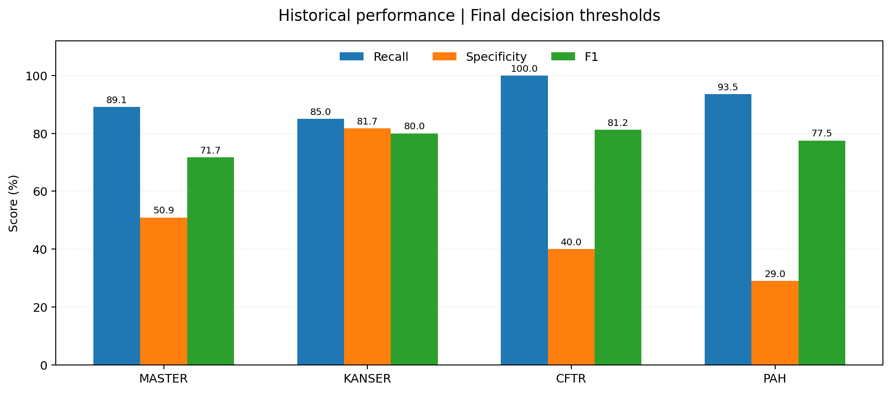

# DeepDiagnosis || 🧬

**Genomic Variant Pathogenicity Classification · TEKNOFEST 2026 — Healthcare AI**

DeepDiagnosis is a team research project investigating machine learning approaches to genomic variant pathogenicity classification across four competition dataset groups: **MASTER, KANSER, CFTR, and PAH**. The original experiments explored ensemble classification, stratified cross-validation, and decision-threshold selection.

> **Research and educational use only.** This project has not been clinically validated and must not be used for diagnosis or medical decision-making.

## Overview

| Component | Approach |
| --- | --- |
| Language | Python |
| Data analysis | Pandas, NumPy |
| Machine learning | scikit-learn |
| Competition experiments | HistGradientBoosting, Random Forest, Logistic Regression, soft-voting ensemble |
| Evaluation | Recall, specificity, precision, F1, MCC, ROC-AUC, PR-AUC |
| Visualization | Matplotlib |

The historical competition workflow included preprocessing, model comparison, cross-validation, and threshold analysis. The **publicly runnable implementation** in `src/pipeline.py` is a separate Logistic Regression baseline; it does **not** reproduce the historical ensemble or its scores.

## Historical results

The following results were recorded at the final decision thresholds in the team's internal competition test simulation.



| Group | Threshold | Recall | Specificity | F1 | MCC |
| :--- | ---: | ---: | ---: | ---: | ---: |
| MASTER | 0.578 | 89.1% | 50.9% | 71.7% | 0.424 |
| KANSER | 0.654 | 85.0% | 81.7% | 80.0% | 0.656 |
| CFTR | 0.654 | 100.0% | 40.0% | 81.2% | 0.523 |
| PAH | 0.714 | 93.5% | 29.0% | 77.5% | 0.304 |

**Interpretation:** High recall does not imply reliable clinical performance; specificity and false-positive rates also matter. These historical results are **exploratory**, not independently reproduced or clinically validated. The original scripts have known preprocessing leakage risks. Results should **not** be attributed to the public baseline. The detailed recorded metrics are in [`results/historical_results.json`](results/historical_results.json).

## Repository structure

```text
DeepDiagnosis/
├── src/                  # Public baseline and synthetic-data generator
├── legacy/               # Original competition scripts (historical reference)
├── results/              # Historical experiment metrics
├── assets/               # Performance visualization
├── docs/                 # Methodology and limitations
├── data/                 # Dataset format guidance (no competition CSVs)
├── tests/                # Pipeline tests
├── requirements.txt
└── README.md
```

## Quick start

Requires **Python 3.10+**. From the repository root:

```bash
git clone https://github.com/fatmaSsm/DeepDiagnosis.git
cd DeepDiagnosis
python -m venv .venv
```

Activate the virtual environment:

```powershell
# Windows PowerShell
.\.venv\Scripts\Activate.ps1
```

```bash
# macOS / Linux
source .venv/bin/activate
```

Install, test, and run an end-to-end example on **synthetic data**:

```bash
pip install -r requirements.txt
python -m unittest discover -s tests -v
python -m src.make_demo_data --output-dir demo_data
python -m src.pipeline train --data-dir demo_data --group ALL
python -m src.pipeline predict --group MASTER --input demo_data/YARISMA_TRAIN_MASTER.csv --output outputs/demo_predictions.csv
```

Synthetic data are for demonstrating the code path, **not** for evaluating genomic classification performance. For separately authorized competition data, see [`data/README.md`](data/README.md).

## Data availability

The original TEKNOFEST competition datasets are **not included** because the team’s approval to publish code does not establish permission to redistribute competition-provided data. The repository includes a synthetic-data generator instead. Original trained models and competition reports are also excluded.

No open-source license is asserted for the historical team code pending a separate licensing agreement.

## Team and documentation

Developed collaboratively by the **DeepDiagnosis team** for TEKNOFEST 2026. The team has approved the publication of the project code; the repository does not claim sole authorship of the competition work.

Technical details, implementation differences, and known limitations: [`docs/METHODOLOGY.md`](docs/METHODOLOGY.md).

---

## 📬 Contact

Fatma Susam

[](https://github.com/fatmaSsm)
[](https://www.linkedin.com/in/fatma-susam/)

---
